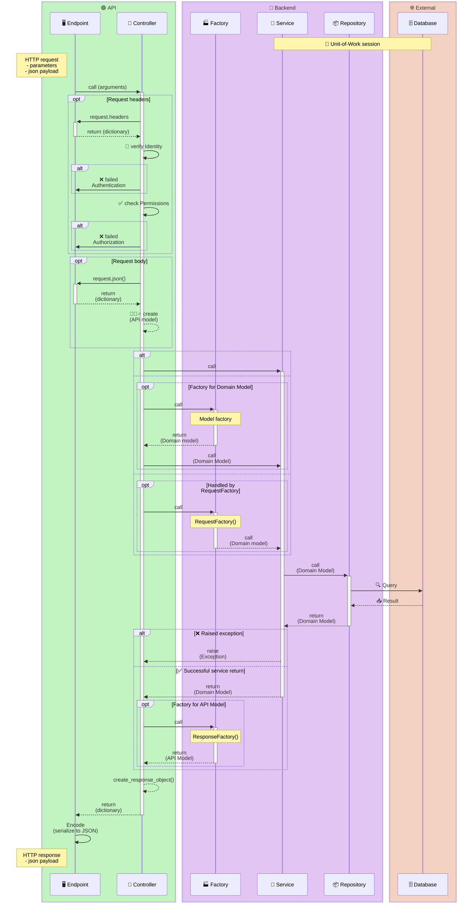

# Design Principles

## Domain Driven Design

Domain-Driven Design (DDD) is a software design approach that emphasizes modeling software based on the core business domain. It promotes a deep understanding of the domain and encourages developers to create software that closely reflects the real-world concepts and processes of the business. In Alpha, we have adopted DDD principles to structure our code and ensure that it is maintainable, scalable, and aligned with the business needs. By organizing our code around the domain, we can create a clear separation of concerns and make it easier to evolve our software as the business requirements change. This approach also helps us to identify and focus on the most important aspects of the domain, leading to better software design and improved communication between developers and domain experts.

The components of Alpha are designed with DDD principles in mind, but it is not necessary to have a deep understanding of DDD to use the library effectively. However, having a basic understanding of DDD concepts can help you to better understand the design choices made in Alpha and how to use the library in a way that aligns with DDD principles.

You can read more about DDD in the [Domain-Driven Design book](https://www.amazon.com/Domain-Driven-Design-Tackling-Complexity-Software/dp/0321125215) by Eric Evans, which is considered the seminal work on the topic. Additionally, there are many online resources and articles that provide insights and best practices for implementing DDD in your projects.

## Software Architecture

In software architecture, we often talk about different layers or components that make up a system. In Alpha, we have organized our code into several key components that work together to create a cohesive and maintainable software architecture. These components include:

- **Domain Models** — represent the core business entities and logic. They encapsulate the state and behavior of the domain and are designed to reflect the real-world concepts of the business. Domain models are typically implemented as classes that contain attributes and methods that define the properties and behaviors of the entities they represent. By modeling our software around the domain, we can create a clear separation of concerns and ensure that our code is closely aligned with the business needs.
- **Interfaces** — define contracts for components to ensure loose coupling and flexibility. By defining interfaces, we can create a clear separation between the implementation of a component and the way it is used by other parts of the system. This allows us to change the implementation of a component without affecting the rest of the system, as long as we adhere to the defined interface.
- **Endpoints** — define the API routes and handle HTTP requests and responses. They serve as the entry point for clients to interact with the application and are responsible for parsing incoming requests, invoking the appropriate business logic, and returning responses to the client. Endpoints can be implemented using frameworks like Flask or FastAPI, and they typically use controllers to handle the request processing and response generation.
- **Controllers** — handle incoming requests and orchestrate the necessary operations to fulfill them. Controllers are responsible for coordinating the flow of data and control between different components of the system. They typically receive requests from endpoints, invoke services to perform business logic, and return responses back to the endpoints. By using controllers, we can keep our endpoints focused on handling HTTP-specific concerns, while the controllers manage the application logic and interactions between components.
- **Services** — contain business logic that doesn't fit neatly into domain models or repositories. Services can be used to implement complex operations that involve multiple domain models or external integrations, providing a clear separation of concerns and keeping the domain models focused on representing the core business entities and logic.
- **Mixins** — provide reusable functionality that can be shared across multiple classes. Mixins are a powerful way to promote code reuse and avoid duplication, allowing you to add common behavior to multiple classes without the need for inheritance. By using mixins, you can keep your code DRY (Don't Repeat Yourself) and maintainable, while still providing the necessary functionality across different components of your application. A Mixin is typically placed in the service layer of an application, as it provides reusable functionality that can be shared across multiple services or components. Mixins can be used to add common behavior to services, such as logging, error handling, or data validation, without the need for inheritance. By using mixins, you can keep your code organized and maintainable, while still providing the necessary functionality across different components of your application.
- **Factories** — handle complex object creation and initialization. They can be used to create domain models, API models, or any other objects that require complex setup. By centralizing object creation logic in factories, we can keep our code organized and maintainable, and ensure that objects are created consistently across the application.
- **Mappers** — handle the mapping between different models, such as domain models and repository models. Mappers can be used to convert data between different representations, ensuring that the data is correctly transformed and consistent across the application. By using mappers, we can keep our code organized and maintainable, and ensure that our models are properly aligned with the needs of the application. The difference between mappers and factories is that mappers are focused on transforming data between different representations, while factories are focused on creating and initializing objects. Mappers typically take an input object and produce an output object, while factories typically take some parameters and produce a new object. Both mappers and factories can be used together to create a clear separation of concerns and promote maintainability in your codebase. Another way to distinguish between mappers and factories is to think of mappers as responsible for the "translation" of data between different layers or components of the application, while factories are responsible for the "construction" of objects based on specific requirements or configurations. Mappers are often used to convert data from one format to another, such as mapping a domain model to a repository model, while factories are used to create instances of objects that may require complex initialization logic or dependencies. By using both mappers and factories effectively, you can create a well-structured and maintainable codebase that promotes separation of concerns and flexibility in your application design.
- **Unit of Work** — manages transactions and coordinates repository operations. The Unit of Work pattern helps to ensure that all operations within a transaction are completed successfully, and if any operation fails, the entire transaction can be rolled back to maintain data integrity. This is particularly important when working with databases or external services, where multiple operations may need to be performed as part of a single logical unit of work.
- **Repositories** — provide an abstraction layer for data access and manipulation. Repositories encapsulate the logic required to access data sources, making it easier to manage and test data interactions.
- **Handlers** — manage the flow of data and control between different components. Handlers are responsible for processing specific types of requests or events, coordinating the necessary operations, and ensuring that the appropriate responses are generated.
- **Providers** — manage authentication and external service integrations. Providers handle the interaction with external systems, such as third-party APIs or authentication services, ensuring that these integrations are consistent and reliable.
- **Utilities** — provide helper functions and common utilities used across the codebase. Utilities offer reusable functionality that can be leveraged by multiple components, promoting code reuse and reducing duplication.

By organizing our code into these components, we can create a clear separation of concerns and make it easier to maintain, evolve our software over time and increase testability. Each component has a specific role and responsibility, which helps to keep our codebase organized and manageable as it grows in complexity. 

Alpha components are designed to work together seamlessly, allowing you to build robust and scalable applications that are aligned with the principles of Domain-Driven Design. Whether you are building a small application or a large enterprise system, the architectural patterns and components provided by Alpha can help you to create software that is maintainable, scalable, and closely aligned with your business needs.

A very useful resource for understanding these concepts is [Architecture Patterns with Python: Enabling Test-Driven Development, Domain-Driven Design, and Event-Driven Microservices](https://www.amazon.com/Architecture-Patterns-Python-Domain-Driven-Microservices/dp/1492052205). This book provides practical insights and examples for implementing these architectural patterns in Python, making it a valuable resource for developers looking to build robust and maintainable software systems.

## Architectural Overview

This sequence diagram provides a high-level overview of how the different components of Alpha interact with each other in a typical application architecture. It illustrates the flow of data and control between the various components, showing how they work together to create a cohesive software system.

The diagram is organized into three main layers: the API layer, the backend layer, and the external layer. 

- The API layer includes the endpoints and controllers that handle incoming HTTP requests and generate responses. 
- The backend layer includes the factories, services, and repositories that implement the core business logic and data access. 
- The external layer includes any external services or databases that the application interacts with. A database is used as an example of an external service, but other external services, like another REST API, could be included as well. 
- The diagram also shows the flow of data and control between the components, illustrating how a typical request is processed through the system.

The diagram also highlights the use of the Unit of Work pattern, which manages transactions and coordinates repository operations to ensure data integrity. The diagram also shows the flow of data and control between the components, illustrating how a typical request is processed through the system.

