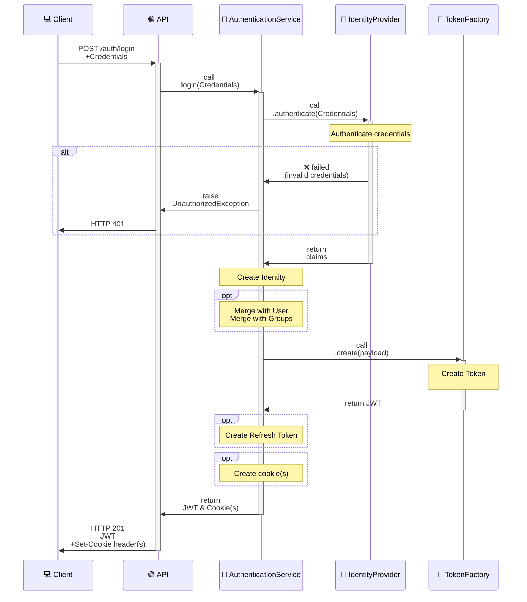
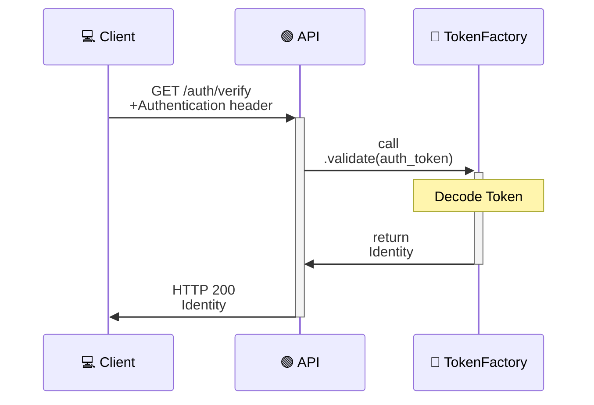
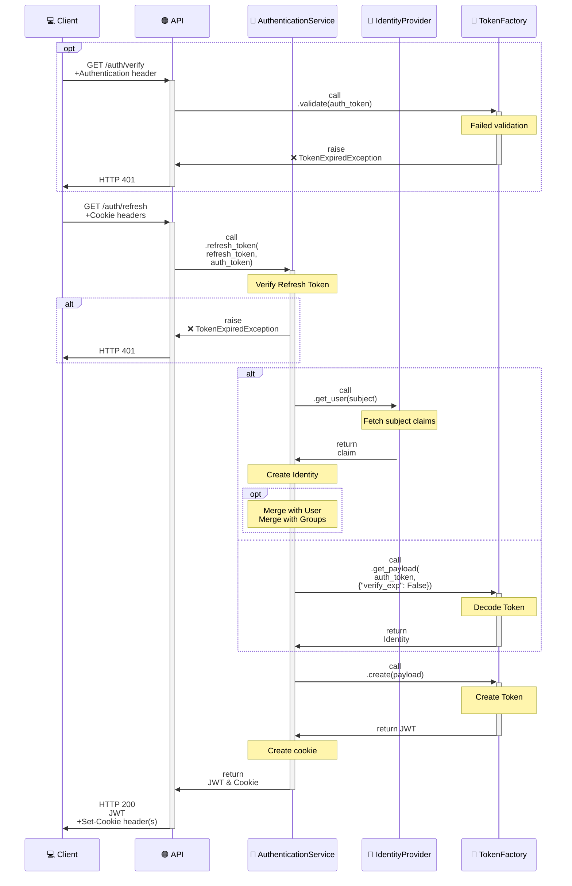

# Authentication

In this guide, we will cover how to implement authentication in your application using the provided tools and best practices. Whether you are using OpenID Connect (OIDC), LDAP, or local password-based authentication, this guide will help you set up a secure and efficient authentication system.

## OpenID Connect (OIDC) Provider

Authentication using OpenID Connect (OIDC) allows users to authenticate using an external identity provider (IdP). This is a popular choice for modern applications as it provides a seamless user experience and leverages existing authentication systems. A popular OIDC provider is Keycloak, which can be easily integrated with your application. In this section, we will go through the steps to set up OIDC authentication in your application.

The [`OIDCProvider`][alpha.providers.oidc_provider.OIDCProvider] class can be used to handle the authentication flow, including token validation and user information retrieval. For Keycloak, you can use the [`KeyCloakProvider`][alpha.providers.oidc_provider.KeyCloakProvider] which extends the [`OIDCProvider`][alpha.providers.oidc_provider.OIDCProvider] and provides additional functionality specific to Keycloak.

### Example OIDC Configuration

```python
from alpha import KeyCloakOIDCConnector, KeyCloakProvider, PasswordCredentials

keycloak_connector = KeyCloakOIDCConnector(
    base_url="https://keycloak.example.com",
    realm="myrealm",
    client_id="myclient",
    client_secret="myclientsecret",
)

keycloak_provider = KeyCloakProvider(connector=keycloak_connector)

credentials = PasswordCredentials(username="user1", password="user1_password")

identity = keycloak_provider.authenticate(credentials)
```

## LDAP or Active Directory Provider

For enterprise applications, integrating with LDAP or Active Directory (AD) is often a requirement. This allows users to authenticate using their existing credentials and simplifies user management. In this section, we will cover how to set up LDAP or AD authentication in your application. The [`LDAPProvider`][alpha.providers.ldap_provider.LDAPProvider] and [`ADProvider`][alpha.providers.ldap_provider.ADProvider] classes can be used to handle authentication against LDAP or AD servers, respectively. We will go through the necessary configurations and code examples to help you get started with LDAP or AD authentication.

These providers will handle the communication with the LDAP or AD server, including binding and searching for user information. You can also implement additional features such as group membership retrieval and role mapping to manage permissions based on LDAP or AD groups. The implementation works with an admin or service account that has the necessary permissions to query the LDAP or AD server for user information. If an user account is used, it is limited to the permissions of that user account, which may not be sufficient for retrieving all necessary user information or performing certain operations. Therefore, it is recommended to use a dedicated service account with appropriate permissions for LDAP or AD authentication.

### Example LDAP Configuration

```python
from alpha import LDAPConnector, LDAPProvider, PasswordCredentials

ldap_connector = LDAPConnector(
    server_uri="ldap://ldap.example.com",
    server_port=636,
    use_ssl=True,
    bind_dn="cn=admin,dc=example,dc=com",
    bind_password="admin_password",
)

ldap_provider = LDAPProvider(
    connector=ldap_connector,
    search_base="ou=users,dc=example,dc=com",
)

credentials = PasswordCredentials(username="user1", password="user1_password")

identity = ldap_provider.authenticate(credentials)
```

## Database Provider

When building a small application or when you want to have full control over the authentication process, password-based authentication can be a suitable choice. In this section, we will cover how to implement password-based authentication securely.

The [DatabaseProvider][alpha.providers.database_provider.DatabaseProvider] provider uses a simple username and password authentication mechanism. The users are stored in a local database, and passwords are securely hashed using a strong hashing algorithm (argon2). The provider will handle authentication, and password management. 

It makes use of a Unit-of-Work pattern to interact with the database, allowing for better separation of concerns and easier testing. When a user attempts to authenticate, the provider will retrieve the user record from the database, verify the provided password against the stored hash, and return an Identity object if authentication is successful. It is important to implement proper security measures when using password-based authentication, such as enforcing strong password policies, implementing account lockout after multiple failed attempts, and using secure communication channels (e.g., HTTPS) to protect user credentials during transmission.

### Example Database Provider Configuration

In this example we use the [`UserLifecycleManagement`][alpha.services.user_lifecycle_management.UserLifecycleManagement] service to manage user accounts and the [`DatabaseProvider`][alpha.providers.database_provider.DatabaseProvider] for authentication.

```python
from alpha import (
    DatabaseProvider,
    SqlAlchemyUnitOfWork,
    SqlAlchemyRepository,
    SqlAlchemyDatabase,
    RepositoryModel,
    User,
    UserLifecycleManagement
    PasswordCredentials
)
from my_app import OrmMapper  # Your SqlMapper implementation for the User model

db = SqlAlchemyDatabase(..., mapper=OrmMapper)

repositories = [
    RepositoryModel(
        name="users",
        repository=SqlAlchemyRepository[User],
        default_model=User,
    )
]

uow = SqlAlchemyUnitOfWork(db=db, repos=repositories)

password_provider = DatabaseProvider(
    uow=uow,
)

user_management_service = UserLifecycleManagement(uow=uow)


# Example of registering a new user
new_user = User(username="user1", password="user1_password")
user_management_service.add_user(new_user)

# Example of authenticating a user
credentials = PasswordCredentials(username="user1", password="user1_password")

identity = password_provider.authenticate(credentials)
```

## Authentication Service

To abstract away the complexities of different authentication methods, you can implement an [`AuthenticationService`][alpha.services.authentication_service.AuthenticationService] that provides a unified interface for authenticating users. This service can internally use different providers (OIDC, LDAP, Password) based on the configuration or user preferences. This approach allows for greater flexibility and maintainability in your authentication system.

The authentication service can also handle additional responsibilities such as token generation, cookie management and mapping of permissions. By centralizing authentication logic in a service, you can ensure that your application remains modular and that authentication concerns are separated from other business logic.

The service uses a [`TokenFactory`][alpha.interfaces.token_factory.TokenFactory] to create authentication tokens (e.g. JWTs) that can be used for authenticating API requests. It can also manage user sessions and provide functionality for logging out users and refreshing tokens when necessary. Refresh tokens can be used to maintain user sessions without requiring them to log in again, while still ensuring that authentication tokens have a limited lifespan for security purposes.

Check the API reference for more details on the configuration options and available methods.

### Diagrams

Sometimes a few nice diagrams say everything you need to know. That is why here are a few diagrams describing the important parts of the authentication flow. 

#### Login

This diagram shows the login flow. A JSON Web Token will be created and returned after a successful authentication. If the `use_cookies` option is enabled the token will also be set as a cookie. A refresh token will also be created and set as a cookie if the `use_refresh_tokens` option is enabled.



#### Verify

This diagram shows the verify flow that can be used to get the token payload. The payload contains an Identity object with values ​​for user info and role, groups, and permissions. This can be useful for displaying UI elements.



#### Refresh

This diagram shows the refresh flow that can be used when the authentication token has expired. The client must recognize that the authentication token has expired and that a refresh is required. After the authentication token is refreshed the initial request should be retried. Both `use_cookies` and `use_refresh_tokens` should be enabled to use this functionality.



### Example Implementation

This section provides a simple example of how to set up an [`AuthenticationService`][alpha.services.authentication_service.AuthenticationService] using a Keycloak OIDC provider. The example demonstrates how to configure the necessary connectors and providers in a dependency injection container. Keep in mind that this is just a starting point, and you may need to customize the implementation based on your specific requirements and the authentication providers you choose to use. The example assumes you have already set up Keycloak and have the necessary credentials to connect to it. There is no one-size-fits-all solution for authentication, so make sure to adapt the implementation to fit your application's needs and security requirements. This implementation does not cover the option to configure local user management with permissions, so if you need that functionality, you will need to implement it separately and integrate it with the [`AuthenticationService`][alpha.services.authentication_service.AuthenticationService].

Here is an example of how to implement an [`AuthenticationService`][alpha.services.authentication_service.AuthenticationService] that uses a Keycloak OIDC provider:

```python
class Container(containers.DeclarativeContainer):
    config = providers.Configuration()

    # Connectors
    keycloak_connector = providers.Factory(
        KeyCloakOIDCConnector,
        base_url=config.keycloak.base_url,
        realm=config.keycloak.realm,
        client_id=config.keycloak.client_id,
        client_secret=config.keycloak.client_secret,
    )

    # Factories
    jwt_factory = providers.Factory(
        JWTFactory,
        secret=config.jwt.secret,
        lifetime_hours=config.jwt.lifetime_hours,
        issuer=config.jwt.issuer,
    )

    # Providers
    keycloak_provider = providers.Factory(
        KeyCloakProvider,
        connector=keycloak_connector,
        token_factory=jwt_factory,
    )

    # Authentication Service
    authentication_service = providers.Factory(
        AuthenticationService,
        identity_provider=keycloak_provider,
        use_cookies=True,
        use_refresh_tokens=True,
    )
```

### OpenAPI Endpoints

Once you have your authentication service set up, you can create OpenAPI endpoints for login, logout, and token refresh. These endpoints will interact with the [`AuthenticationService`][alpha.services.authentication_service.AuthenticationService] to perform the necessary authentication operations. For example, a login endpoint might look like this:

```yaml
paths:
  /auth/login:
    post:
      description: Authenticate user and generate access token
      operationId: login
      requestBody:
        description: Password credentials
        content:
          application/json:
            schema:
              $ref: "#/components/schemas/Credentials"
      responses:
        '201':
          description: Created
          x-alpha-cookie-support: true
          content:
            application/json:
              schema:
                $ref: '#/components/schemas/StringResponse'
                description: Generated access token
      tags: [Authentication]
      x-alpha-service-name: authentication_service
      x-alpha-service-method: login
      x-alpha-request-factory: true
components:
  schemas:
    Credentials:
      type: object
      properties:
        username:
          type: string
          example: abc123
        password:
          type: string
          format: password
          example: welcome123
    Response:
      type: object
      properties:
        detail:
          type: string
          example: OK
        status:
          type: integer
          example: 200
        title:
          type: string
          example: OK
        type:
          type: string
          example: 'application/json'
        data: {}
    StringResponse:
      allOf:
        - $ref: '#/components/schemas/Response'
        - type: object
          properties:
            data:
              type: string
```


